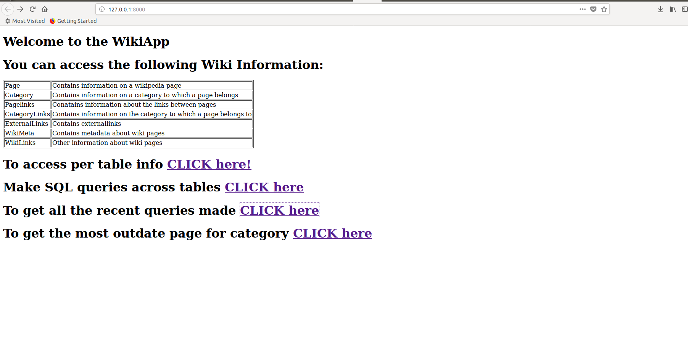
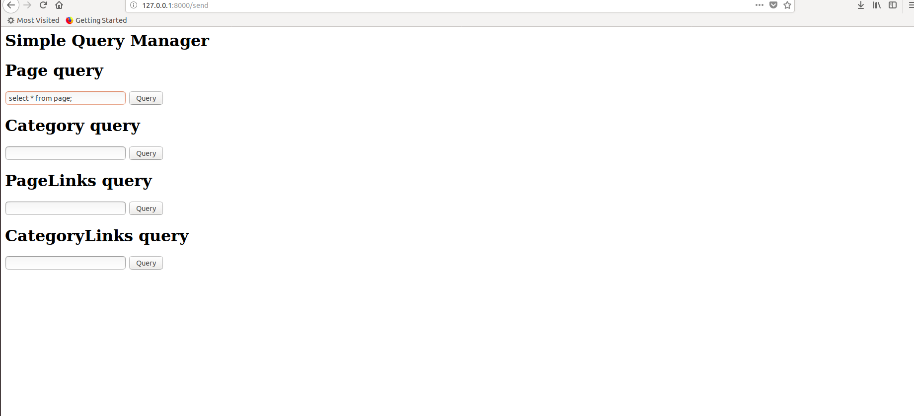
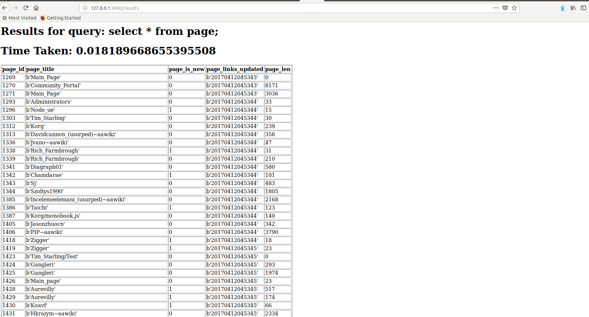
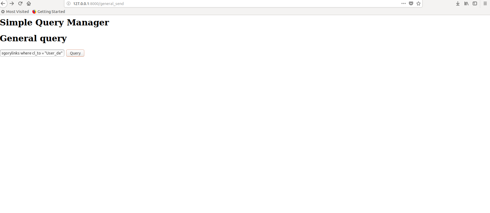
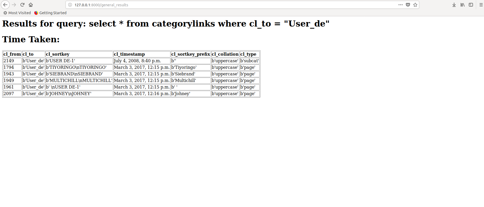
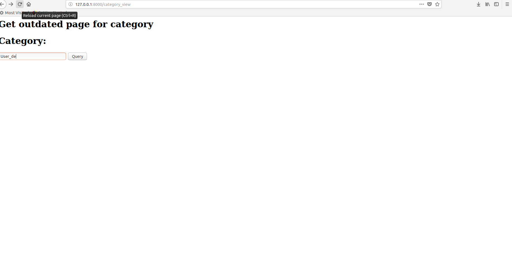
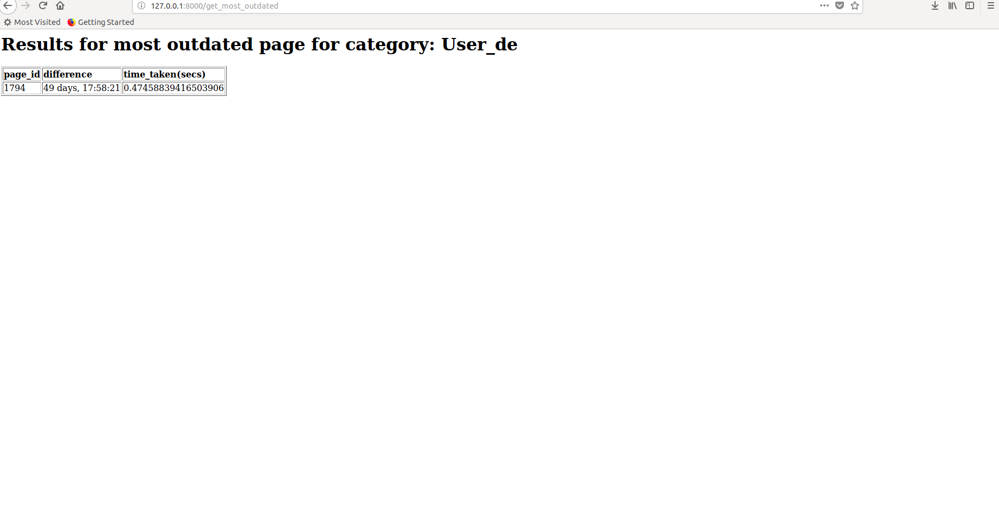
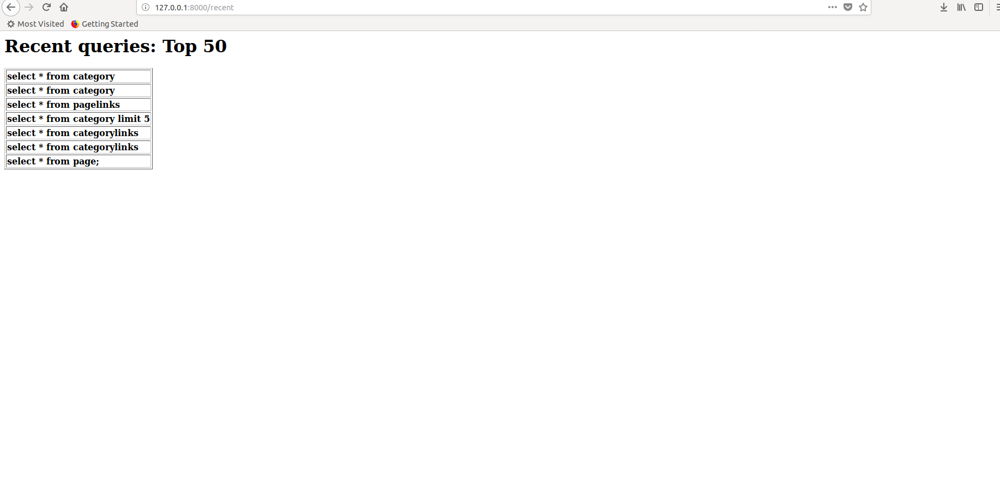
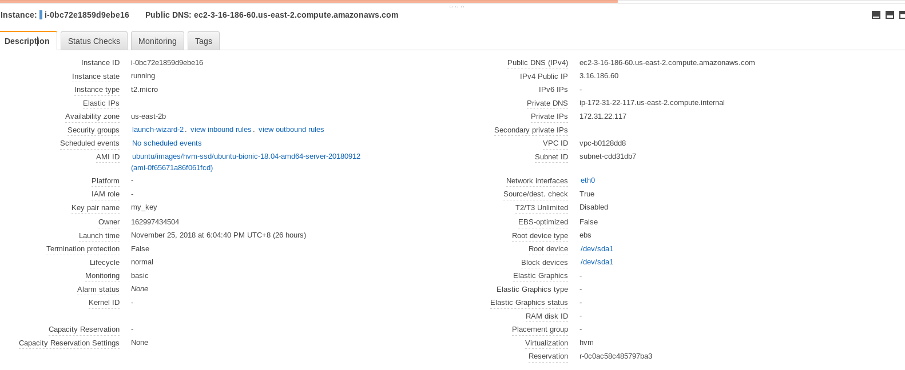

#WikiApp: A sql agent for wikipedia

### Problem Statement.
    1. Create a database based on the Simple English Wikipedia content. This database
        should contain the following:
        ○ Basic metadata for every wiki page:
        i. Page title
        ii. Categories of the page
        iii. Date of last modification
        ○ The links between the wiki pages, defined by the following:
        i. The page which refers to another page
        ii. The referred page
        iii. The position of this link in the ordered list of all the links on the referring
        page.
    
        ○ You’re allowed to make simplifications (in case something is not trivial to
        implement) but you have to document your decisions about these simplifications.
        ○ There are public downloadable dumps of the Wikipedia content. You can
        download and preprocess these dumps as you wish, but please don’t forget to
        share the preprocessing code with us.
    
    2. Create a web UI which contains an SQL interface for your database. Use a free cloud
    provider for deploying your application. The user of this UI have to be able to type SQL
    queries into a form and it has to display the result of the query.
    3. Using your database, write and SQL query to find the wiki page which:
        ○ corresponds to a given category
        AND
        ○ it is the most outdated
        A page is called outdated if at least one of the pages it refers to was modified later than
        the page itself. The measure of this outdatedness is the biggest difference between the
        last modification of a referred page and the last modification of the page.
    4. Create a simple web UI for the solution of question 3 where the user can enter a
    category and the UI displays the title of the page.
    5. Display the running time of the SQL queries on the web UI.
    6. You have to submit all of your code and a short documentation about your application
    and thought process.

###A short introduction.

This small project introduces a very simple web UI that provides a simple form where users
can add sql queries and get results in return. My goal in this documentation, would be to
take you through a different development stages, highlighting the difficulties faced, some
redundancy that were identified later and few observations.

###Choice of the database.
Due to my prevalent experience with document and columnar databases, like Mongodb and
Cassandra, I initial choice was to move forward with one of them, and hence one of my inital
scripts, parses the "aawiki-20181101-pages-meta-current.xml" using xml_parser.py and load the
documents on to MongoDB. It is generally easier to stick your data in and later depending upon
the type of queries, indexing, or sharding techniques may be used to speedup the queries.
It was at this time(data finding phase), that I found there were mysql dumps of various kind
of wiki data on aawiki servers such as page, categories, pagelinks, categorylinks. Therefore, at the
end i chose Mysql for the following reason.
1. Data considered is quite small in volume, can be on a single node machine with just
   few gbs of disk space.
2. It was easier to just load the dump by mysqldump command.
3. The final interface should be able to support sql. Moving with mongodb, would have required
   a sql parser, which may or may not be a trivial task.
   (Eg. NoSqlBooster for MongoDB)

###About Data.
Data link: https://ftp.acc.umu.se/mirror/wikimedia.org/dumps/aawiki/20181101/

https://www.mediawiki.org/wiki/ outlines the structure in which the wiki dump should be made
and distributed.

The types of data were:
1. All Titles
2. Pages (Denoting a wikipedia page) \
3. Category Links
4. PageLinks
5. Metadata
6. MetaHistory
and various others.

For our purpose, it was important to have information of pages(titles, last_modification_time),
categories of page, links between page. Therefore, instead of utilizing the entire dump, which
was redundant, I used pages, category, pagelinks, category and page metadata.

```
+----------------------------+
| Tables_in_test_db          |
+----------------------------+
| auth_group                 |
| auth_group_permissions     |
| auth_permission            |
| auth_user                  |
| auth_user_groups           |
| auth_user_user_permissions |
| category                   |
| categorylinks              |
| django_admin_log           |
| django_content_type        |
| django_migrations          |
| django_session             |
| externallinks              |
| page                       |
| pagelinks                  |
| wiki_link                  |
| wiki_meta                  |
+----------------------------+
17 rows in set (0.00 sec)

```

### parsing the metadata xml

This is a short page component in the xml file.
```
<page>
    <title>Wikipedia:Community Portal</title>
    <ns>4</ns>
    <id>1270</id>
    <revision>
      <id>3990</id>
      <parentid>3901</parentid>
      <timestamp>2010-03-25T07:14:32Z</timestamp>
      <contributor>
        <username>Jyothis</username>
        <id>1968</id>
      </contributor>
      <comment>/* Alecs.bot */</comment>
      <model>wikitext</model>
      <format>text/x-wiki</format>
      <text xml:space="preserve">==Welcome==
```

From the information above, it is clear that one can get a lot of information from 
an xml component, I can get title, id, revision id, timestamp(last modification time),
and also text.
One can argue, that such information can be found in the page dump also, which is true,
however, timestamp attribute is important for our case, and hence creating a partly redundant page metadata
table  was OK in the first development stage.

To parse the xml, I used the xml python package in python. However, it is to be noted, that
there are 2 ways to parse a xml file, either load the entire xml into memory in the form
of tree(like DOM), and then run queries across the tree. However, this isn't a good approach,
as xml trees are memory inefficient and some xml files are as big as 5-10 GB.
<br/>
Another approach to the same thing, is to just read the xml line by line, an emit start and
end events based on start and end tags and gathering values. So, obviously, the second approach
is considered, an for each page, a  dictionary is created and output to a mysql called db_info.dump

#####Redundancy encountered.

While moving forward with the project, I stumbled upon a well-documented python package 
known as wikipediaapi that loads a wikipedia page and after parsing extracts various information
such as links from the page, categories from the pages, authors etc. This is used to get the links
and categories before using the dump files(categorylinks, pagelinks, externallinks). However,
noting that the dump files are more trustworthy, this approach was later discarded.

#WEB UI

####Framework

The framework used for building the web api is django. The goal of web framworks is to make
the process of ui building easier and there are tons of  frameworks to use from, however, due
to my experience with django, it was the best choice, given its strong community base.

####Importance of ORM

Django provides the ORM interface through the Model Class from django.db. It is was easier
for a programming language like python to work with objects than Tables and Rows(sql db),
hence the ORM layer connects the language types to database concepts.

####Overall structure

```
 wiki
 |--------wiki
           |--------settings.py
           |--------urls.py
           |--------wsgi.py
           |--------__init__.py
 |---------log
           |--------django.log
           |--------info.log
 |---------querymanager
           |---------admin.py
           |---------apps.py
           |---------cache.py
           |---------handlers.py
           |---------models.py
           |---------query_stats.py
           |---------tests.py
           |---------urls.py
           |---------views.py
           |---------templates
                     |----------querymanager
                                |--------------htmls

```
* wiki/ : main project folder
* wiki/settings.py : Django settings file, used to do migrations and control the
configuration of different components such as db, logging, caches.
* querymanager/ : main app folder
* querymanager/cache.py : Custom implemented caching layer.
* querymanager/handlers.py : Custom handlers for requests.
* querymanager/query_stats : Tailing the log file, to calculate various statistics.
* querymanager/views.py: The main request handler page.

#TYPES OF QUERIES SUPPORTED.



#### Simple per table queries.



#### General across table queries.


#### Category outdated queries.


####Recent page


#DEPLOYMENT

For the purpose of deployment, an ubuntu micro EC2 instance was used for deployment.
Linux micro EC2 instance was started first, however, I found ubuntu more easier to work with, hence
shifted to it.(particularly because of yum, since i was more adapted to apt-get installer.)



## Deployment script.
```
#Setup mysql
sudo apt-get update
sudo apt-get install mysql-server mysql-client
sudo mysqladmin -u newuser -h localhost password 'password'


#setup mongo (optional)
sudo apt-key adv --keyserver hkp://keyserver.ubuntu.com:80 --recv 9DA31620334BD75D9DCB49F368818C72E52529D4
echo "deb [ arch=amd64 ] https://repo.mongodb.org/apt/ubuntu bionic/mongodb-org/4.0 multiverse" | sudo tee /etc/apt/sources.list.d/mongodb-org-4.0.list
sudo apt-get update
sudo apt-get install -y mongodb-org
sudo service mongod restart
sudo service mongod status

#Setup python pip
sudo apt-get install python3-pip
# However pip comes bundled with python3.6, so can run using python3.6 -m pip install [package]
sudo pip3 install virtualenv
virtualenv -ppython3 venve

#Cloning the git repo into the home directory
git clone https://github.com/RohitDas/WikiApp.git
source venve/bin/activate
pip install -r WikiApp/requirements.txt

#create supervisorctl configuration for the file.
sudo cp WikiApp/wikiapp.conf /etc/supervisor/conf.d
sudo mkdir /var/log/wikilog
sudo supervisorctl reread
sudo supervisorctl update

#To check
sudo supervisorctl status

```

## Accessing the UI.
```
http://3.16.186.60:8000/
```

# FUTURE WORK

* Advanced query stats:  Currently, I have implemented a simple log tailer, that looks for
  specific query lines, and calculates the top 50 recent queries made by different users. However, with other technologies out there, most prominent of them
  being ElasticSearch server, along with a client that tails the log file, and sends messages to 
  the server. One can visualise and generate various insights using the power of ElastidSearch.
* Advanced caching:  Currently, I have implemented an unoptimized version of LRU Cache. As a next step,
  one can simple optimize it using the help of augmented data structures. However, in-memory cache
  such as Redis or Memcache might as well be used. My choice will be Redis because of its
  wider data structure support.
* Beautifying the user interface is one of the things that is left out, making it more
  attractive in future is one of the goals.
* Use Django Channels to make the UI more responsive.
* handling various security aspects, Authentication, Authorisation

# Github link:
```
https://github.com/RohitDas/WikiApp/
```


#Getting most outdated link.

```
Running get outdated query for category = 'User_sk', provides the following information.

mysql> select distinct v2.pl_from, v2.page_id, w.ts - w1.ts from (select pl.pl_from, pl.pl_title, p.page_id from pagelinks as pl, page as p, 
(select p.page_id, p.page_title from categorylinks as c,page as p  where c.cl_to = "User_sk" and c.cl_from = p.page_id) as v1 where v1.page_id = pl.pl_from and p.page_title = pl.pl_title) as v2,
 wiki_meta as w, wiki_meta as w1  where v2.pl_from = w.id and v2.page_id = w1.id and v2.pl_from != v2.page_id;
+---------+---------+--------------+
| pl_from | page_id | w.ts - w1.ts |
+---------+---------+--------------+
|    1826 |    1980 |     80076110 |
|    1826 |    1982 |  10506189809 |
|    1980 |    1982 |  10426113699 |
+---------+---------+--------------+
3 rows in set (0.36 sec)

```
Modifying the query a bit, gives you.

```
select distinct v2.pl_from, max(w.ts - w1.ts) as diff from (select pl.pl_from, pl.pl_title, p.page_id from pagelinks as pl,
 page as p, (select p.page_id, p.page_title from categorylinks as c,page as p  where c.cl_to = "User_sk" and c.cl_from = p.page_id) as v1 
 where v1.page_id = pl.pl_from and p.page_title = pl.pl_title) as v2, wiki_meta as w, wiki_meta as w1  where v2.pl_from = w.id and v2.page_id = w1.id and v2.pl_from != v2.page_id
 group by v2.pl_from order by diff DESC limit 1;
+---------+-------------+
| pl_from | diff        |
+---------+-------------+
|    1826 | 10506189809 |
+---------+-------------+
1 row in set (0.38 sec)

```

This gives you the most outdated page.

Note: One thing is to be noted, that diff may be negative for all pages for a category, so one should handle the 
particular case.


